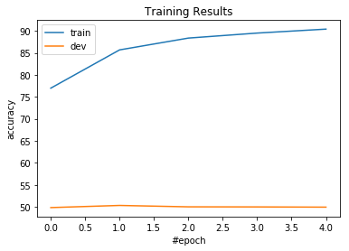
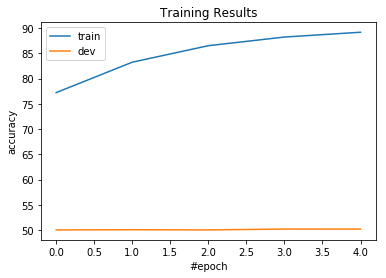

### Project #1 report 
-------------------------
by Jibang Wu, jw7jb

2.1 what you do reduce the feature size and the size of the feature set.
- tokenize sentences by nltk
- term frequency count
- map tokens to lower case
- map tokens that are digits to 'NUM'
- map tokens with term frequency <5 to 'UNK'
- add bias term in feature to accomadate offset in linear correlation
- use binary bag of word representation f(x,y) with feature size of 56905

2.2 Perceptron algorithm accuracy curves on both training and development sets

2.3 Averaged Perceptron algorithm accuracy curves on both training and development sets

3.1 the size of feature set is 47963
Training accuracy = 0.8618
Dev accuracy = 0.5039

3.2 the size of feature set is 
Training accuracy = 0.8618
Dev accuracy = 0.5039

3.3 for $\lambda \in {{ 10^{-4}, 10^{-3}, 10^{-2}, 10^{-1}, 1, 10, 100 }}$
With regularization parameter λ = 100.000000
Training accuracy = 0.9441
Dev accuracy = 0.8953

With regularization parameter λ = 10.000000
Training accuracy = 0.9936
Dev accuracy = 0.9047

With regularization parameter λ = 1.000000
Training accuracy = 0.9999333333333333
Dev accuracy = 0.9044

With regularization parameter λ = 0.100000
Training accuracy = 1.0
Dev accuracy = 0.9026

With regularization parameter λ = 0.010000
Training accuracy = 1.0
Dev accuracy = 0.9013

With regularization parameter λ = 0.001000
Training accuracy = 1.0
Dev accuracy = 0.8954

With regularization parameter λ = 0.000100
Training accuracy = 1.0
Dev accuracy = 0.892

3.4 L1 regularization prefers sparse solutions because the loss function depends on the distance of the weight to origin; As the more sparse the solution is, the lower the loss function is.

for $\lambda \in {{ 10^{-4}, 10^{-3}, 10^{-2}, 10^{-1}, 1, 10, 100 }}$
With regularization parameter λ = 100.000000
Training accuracy = 0.8334333333333334
Dev accuracy = 0.8248

With regularization parameter λ = 10.000000
Training accuracy = 0.9114333333333333
Dev accuracy = 0.892

With regularization parameter λ = 1.000000
Training accuracy = 0.9917666666666667
Dev accuracy = 0.8973

With regularization parameter λ = 0.100000
Training accuracy = 1.0
Dev accuracy = 0.8929

With regularization parameter λ = 0.010000
Training accuracy = 1.0
Dev accuracy = 0.8916

With regularization parameter λ = 0.001000
Training accuracy = 1.0
Dev accuracy = 0.8974

With regularization parameter λ = 0.000100
Training accuracy = 1.0
Dev accuracy = 0.8887

3.5 The best model has the size of feature set is 693246
Training accuracy = 0.9943666666666666
Dev accuracy = 0.9052

- map tokens to lower case
- map tokens that are digits to 'NUM'
- remove token with df less than 2
- tokenize sentences by nltk
- removed stopwords
- use l2 regularization

